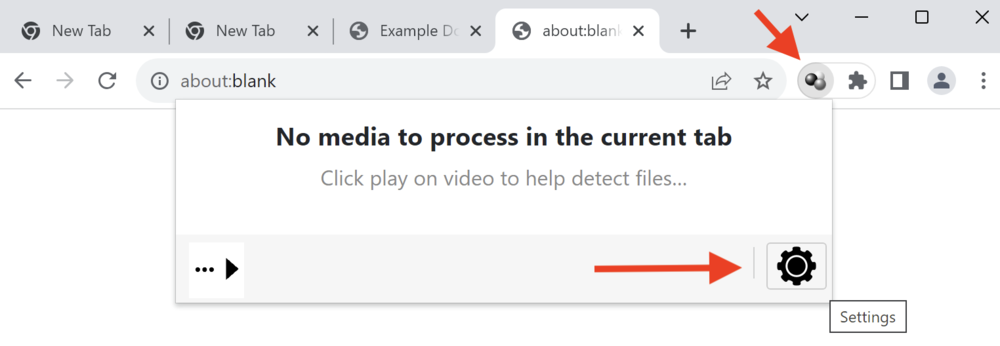
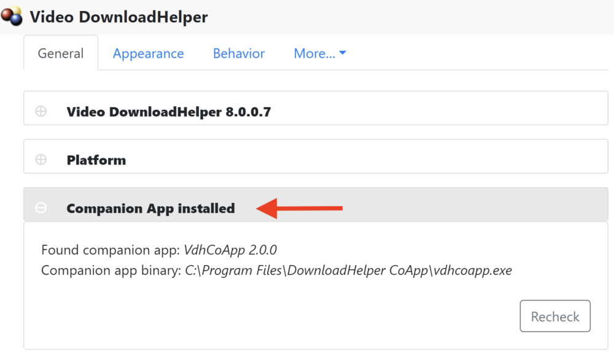

# DownloadHelper CoApp

*DownloadHelper CoApp* is a multi-platform (Windows, Mac, Linux) application
providing the [Video DownloadHelper](https://downloadhelper.net/)
browser add-on with a set of extra features not available directly
from the add-on:

- file writing API
- launching default video player application on a data file
- a build of the [ffmpeg](http://ffmpeg.org/) video converter

*DownloadHelper CoApp* complies with the
[native messaging protocol](https://developer.mozilla.org/en-US/Add-ons/WebExtensions/Native_messaging)
and is not intended to be used directly from the command line.

Installer executables for the various platforms are available
from the [releases page](https://github.com/aclap-dev/vdhcoapp/releases).

# Installation

**Windows**: download the `.exe` file, double click on it, and follow the instructions.

**Mac**: download the `.pkg` file, double click on it, and follow the instructions.

**Linux debian-based**: download the `.deb` file and install it: `sudo dpkg -i <deb file>`.

**Linux other**: download the `.tar.bz2` file, unpack and move to a desired location, and run `./vdhcoapp install`.

At this point, the app should be recognised within your browser.

You can check in the Video DownloadHelper add-on settings:

# Alternative installation methods

**Mac DMG**: download the `.dmg` file, open it and move the app to **Application** folder.
Launch the app once to register its manifest within the different browsers (it will show
a notification then close). Re-run the app if you ever move the application to a new location.

**Linux tar.bz2**: download the `.tar.bz2` file, extract it where ever you want to
install the app, then run `<install location>/vdhcoapp install` to register the
manifest within the different browsers. Re-run the install command if you ever move
the application to a new location.

# Troubleshooting

If the coapp is not recognised by the extension, here are a few things you can try:

- restart your browser
<<<<<<< Updated upstream
- make sure the Video DownloadHelper addon is at least version 8, and has been installed from its official location:
  - Chrome: https://chrome.google.com/webstore/detail/video-downloadhelper/lmjnegcaeklhafolokijcfjliaokphfk
  - Firefox: https://addons.mozilla.org/en-US/firefox/addon/video-downloadhelper/
  - Edge: https://microsoftedge.microsoft.com/addons/detail/video-downloadhelper/jmkaglaafmhbcpleggkmaliipiilhldn
- On Mac, double click on the coapp, this should re-register the app in the relevant browsers.
- On Linux, run `/opt/vdhcoapp/vdhcoapp install` to re-register the app. And Look at the note below about Flatpak and Snap browsers.
=======
- make sure the Video DownloadHelper addon is at least version 8, and has been installed from its official location: https://www.downloadhelper.net/install
- on Mac, double click on the coapp, this should re-register the app in the relevant browsers.
- on Linux, run `/opt/vdhcoapp/vdhcoapp install` to re-register the app. And Look at the note below about Flatpak and Snap browsers.
>>>>>>> Stashed changes

# Notes about Flatpak browsers

**Firefox**: it should work out of the box.

**Chromium based browsers (Chrome, Brave, …)**: if the coapp is not visible from your browser, you can trigger the coapp flatpak registration with: `vdhcoapp install`.

# Notes about Snap browsers

**Firefox**: it should work out of the box.

Snap Chromium-based browsers do not supported native messenging yet. It is up to Google to fix this issue.

# Note about the registration process

After the app is installed, the coapp installs a json file into browser-specific directories,
as described by the Mozilla, Google and Microsoft documentation:

- https://developer.mozilla.org/en-US/docs/Mozilla/Add-ons/WebExtensions/Native_manifests
- https://developer.chrome.com/docs/extensions/mv3/nativeMessaging/#native-messaging-host-location
- https://learn.microsoft.com/en-us/microsoft-edge/extensions-chromium/developer-guide/native-messaging?tabs=v3%2Cwindows

You can see the list of files installed by running the app with the argument `sudo vdhcoapp install`
(if installed as a root user) and `vdhcoapp install --user` (if installed as non-root user).
Those files can be remove with `vdhcoapp uninstall [--user]`.

